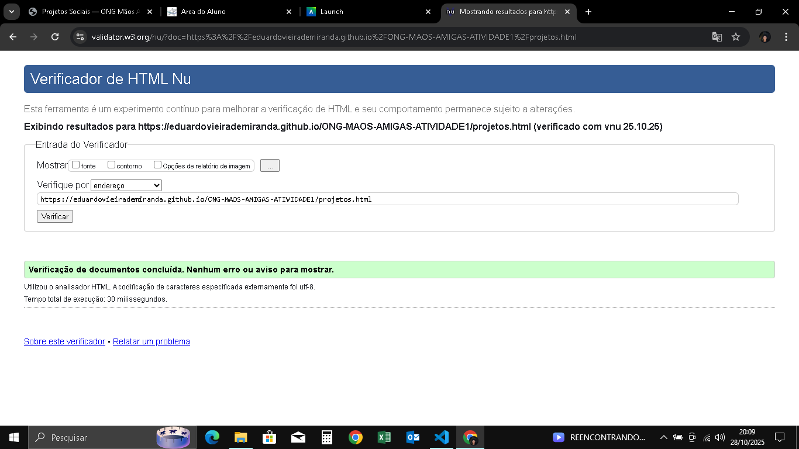
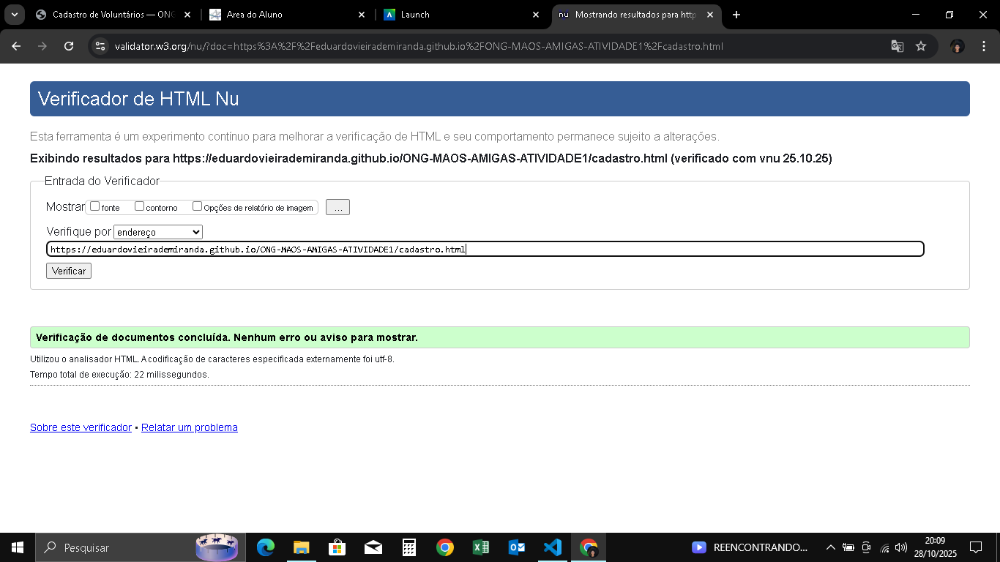

# 🌍 ONG MÃOS AMIGAS — Atividade 1

Este repositório contém a **primeira etapa** do projeto da disciplina **Desenvolvimento Front-End para Web** da **Cruzeiro do Sul Virtual**.

---

## 📋 Descrição

A **Atividade 1** tem como objetivo desenvolver a **estrutura HTML5** de um site fictício de uma ONG, utilizando **marcação semântica**, **acessibilidade básica** e um **formulário com máscaras funcionais**.

---

## 🧱 Estrutura de Pastas

index.html
projetos.html
cadastro.html
imagens/

As páginas estão organizadas de forma semântica e as imagens estão centralizadas na pasta **/imagens**.

---

## 💡 Tecnologias Utilizadas

- **HTML5** — estrutura semântica  
- **JavaScript (jQuery Mask Plugin)** — aplicado em campos de CPF, Telefone e CEP  

---

## ✅ Requisitos Atendidos

- Uso correto de tags semânticas (`header`, `main`, `section`, `footer`)  
- Estrutura em múltiplas páginas  
- Formulário funcional com máscaras  
- Imagens otimizadas e com texto alternativo (`alt`)  
- Código validado no **W3C Validator**

### 🖼️ Prints da Validação W3C

### 🖼️ Prints da Validação W3C

  
  

---

## 📬 Contato

Desenvolvido por **Eduardo Vieira de Miranda**  
[GitHub: eduardovieirademiranda](https://eduardovieirademiranda.github.io/ONG-MAOS-AMIGAS-ATIVIDADE1/)
